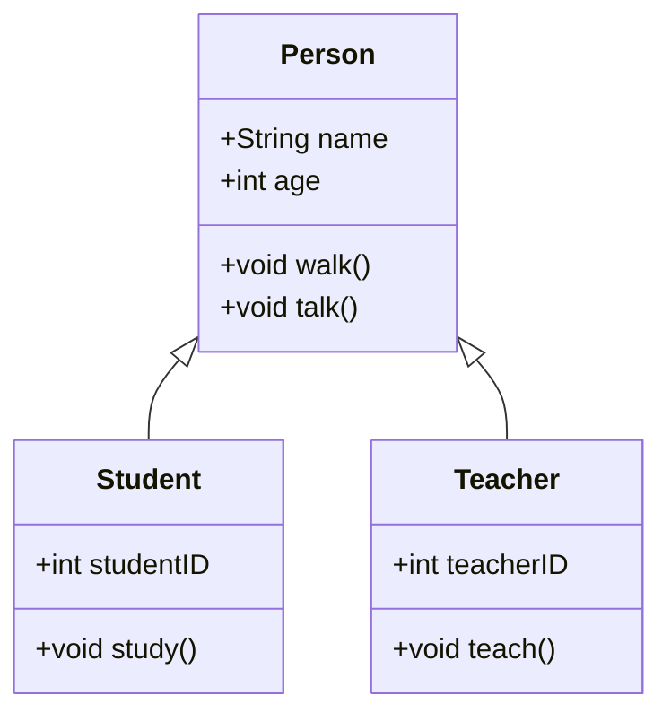
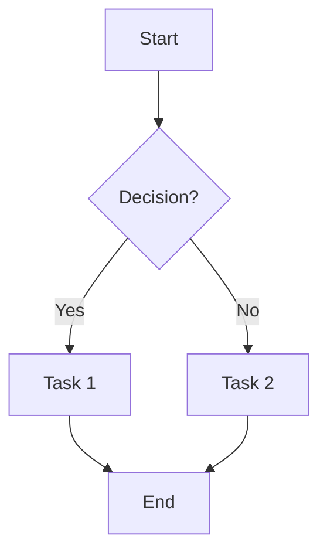
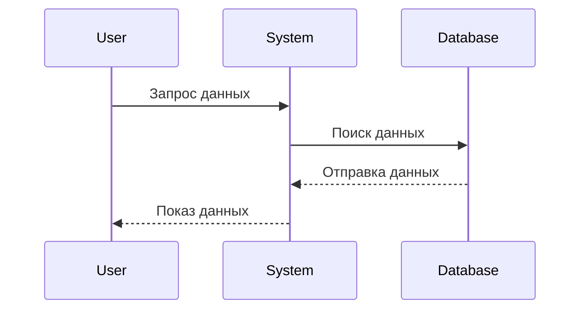

## 1. Class Diagram

```mermaid
classDiagram
    class Person {
        +String name
        +int age
        +void walk()
        +void talk()
    }

    class Student {
        +int studentID
        +void study()
    }

    class Teacher {
        +int teacherID
        +void teach()
    }

    Person <|-- Student
    Person <|-- Teacher
```

## 2. Activity Diagram

```mermaid
graph TD
    A[Start] --> B{Decision?}
    B -->|Yes| C[Task 1]
    B -->|No| D[Task 2]
    C --> E[End]
    D --> E
```

## 3. Sequence Diagram

```mermaid
sequenceDiagram
    participant User
    participant System
    participant Database

    User->>System: Запрос данных
    System->>Database: Поиск данных
    Database-->>System: Отправка данных
    System-->>User: Показ данных
```
